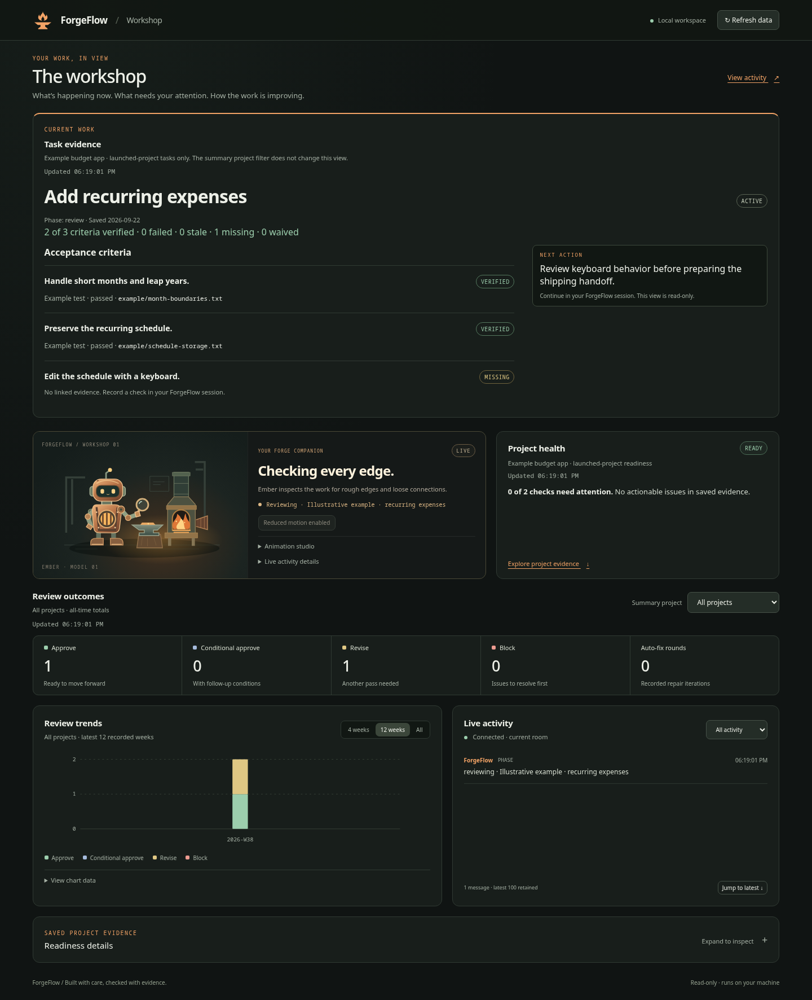
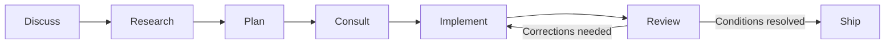

# ForgeFlow

**A software delivery workshop for Claude Code and Codex.**

Turn an idea into a scoped brief, working code, an evidence-backed review, and a clear shipping handoff. ForgeFlow coordinates specialist agents, keeps useful project context, and makes reported work visible in a local dashboard with Ember, a small robot tending the forge.

**Start here:** [Visual user guide](docs/user-guide.html) · [19-page PDF](docs/ForgeFlow-User-Guide.pdf) · [Documentation](docs/index.html) · [Install](#quick-start)



## New in 4.4.0

Keep an objective, acceptance criteria, code-bound evidence, and resumable phase history together with **`/task` in Claude Code or `$task` in Codex**. The workshop shows current proof and the next action, and remains responsive while checking saved tasks.

This release also adds balanced workflow comparison schedules, dependency-aware memory feedback, fleet ownership checks across every Git state, and bounded local CI repair with draft handoffs. Evaluation records distinguish real observations from fixtures and unknowns; maintenance publishes nothing remotely. See the [4.4.0 release notes](docs/changelogs/v4.4.0.html) and [task guide](docs/wiki/Task-Evidence.md).

## Your first ForgeFlow session

For a change you want to carry across sessions, use **`/task` in Claude Code or `$task` in Codex**. Tasks connect acceptance criteria to the code that was checked, preserve interrupted phase history, and appear at the top of the workshop. Changed source or evidence makes earlier proof stale while preserving the historical result. See [task evidence and recovery](docs/wiki/Task-Evidence.md) for check commands, resume, evaluation, memory feedback, fleet contracts, and local maintenance drafts.

You do not need the whole command catalog to start. Pick one small, observable improvement, such as a clearer empty state or a focused bug fix.

| Step | Claude Code | Codex | What you should get |
|---|---|---|---|
| Design the change | `/consult` | `$consult` | A concrete brief with scope, behavior, and validation |
| Build it | `/implement` | `$implement` | Focused code changes and the results of relevant checks |
| Review it | `/review` | `$forge-review` | Findings tied to evidence, followed by a technical verdict |
| Prepare to ship | `/ship` | `$ship` | A summary, presentation, and proposed PR description |

Add your task after the command. Run one phase at a time, inspect the result, and steer the assistant when something needs to change. In Codex, use **`$forge-review`** for ForgeFlow; `/review` is the host’s built-in review.

For example, after installation, type this into Codex:

```text
$consult plan a helpful empty state for the task list. Reuse the existing Create task form, include keyboard behavior, and keep the change local.
$implement execute the current brief and run the relevant checks
$forge-review review the current changes against the brief
$ship prepare the branch and summarize validation
```

Use the Claude Code equivalents from the table in that host. When you are ready for remote actions, explicitly request the commit, push, PR, or deployment you want. Preparing a shipping handoff does not itself authorize every release action.

## Visual user guide

The illustrated guide takes a new user through installation, a first project, every delivery phase, the workshop dashboard, Ember’s states, context and memory, troubleshooting, and shipping.

- **[Interactive HTML guide](docs/user-guide.html):** 18 chapters, annotated screenshots, examples for both hosts, copy controls, and a checklist saved in your browser. Download the HTML file from GitHub and open it in a browser. Images, styles, and scripts are embedded, so the guide works offline; linked reference documents need a connection.
- **[Printable PDF guide](docs/ForgeFlow-User-Guide.pdf):** 19 pages with a linked contents page, both hosts’ examples, and the visual reference material. Ready to share with someone new to ForgeFlow.

The guide identifies the source commit it describes. For the latest implementation details, use this README and the [workflow reference](docs/wiki/Workflow-Commands.md).

## Quick start

You need Git, Node.js with npm, Bash for the shell helpers, and a working Claude Code or Codex setup with access to the models you intend to use. Use **Node.js 24** for this repository's local validation. The examples below use Bash; keep the host, installation, and project in the same shell environment.

RTK is optional. The installer checks `rtk --version` and `rtk gain`; ordinary installation does not download RTK. Use direct commands when it is unavailable. To opt in to a Cargo-based RTK installation, add `--install-rtk` (preview with `--install-rtk --dry-run`). See [optional RTK setup](docs/wiki/Template-Installer.md#optional-rtk).

Clone the source:

```bash
git clone https://github.com/BrandedTamarasu-glitch/ForgeFlow.git
cd ForgeFlow
```

### Install into Codex

Preview the managed destinations, then install:

```bash
node scripts/forgeflow/install-template.js --target codex --dry-run --json
node scripts/forgeflow/install-template.js --target codex
```

Restart Codex so it discovers the agents and skills. The installer respects `CODEX_HOME`, copies runtime helpers into its `forgeflow/` directory, and preserves unrelated host configuration. It does not merge the repository’s sample config into yours.

Use `$quick` or `$consult` in your project to confirm discovery. All ForgeFlow agents inherit your Codex session's model and reasoning settings by default. If an older installation reports a model unsupported by your account, update the checkout, rerun the Codex installer, and start a fresh session. Custom model overrides must use models available to your account. See [Codex first run](docs/wiki/Codex-First-Run.md).

### Install into Claude Code

From the same source checkout:

```bash
node scripts/forgeflow/install-template.js --target claude --dry-run --json
node scripts/forgeflow/install-template.js --target claude
```

Restart Claude Code. Merge the documented hooks and status line into your existing `~/.claude/settings.json`, preserving unrelated settings and avoiding duplicate registrations. The installer leaves that settings merge to you. See [Settings and Recovery](docs/wiki/Settings-And-Recovery.md).

For an existing Claude installation, `/update-forgeflow` is the regular updater; `--repair` reinstalls missing or damaged managed files. The updater supports rollback to its previous managed-file snapshot when available. These are Claude updater capabilities, not a general Codex rollback mechanism.

To install both hosts from a checkout, use `--target both`. See the [template installer](docs/wiki/Template-Installer.md) for custom home directories.

### Enable the optional dashboard

Set the runtime path for the host you installed:

```bash
# Codex:
FF_RUNTIME="${CODEX_HOME:-$HOME/.codex}/forgeflow"

# Or Claude Code:
# FF_RUNTIME="$HOME/.claude/forgeflow"
```

Install the local services’ dependencies:

```bash
npm install --prefix "$FF_RUNTIME/services/dashboard" --ignore-scripts
npm install --prefix "$FF_RUNTIME/services/agent-chat" --ignore-scripts
```

On the first eligible ForgeFlow workflow invocation in a desktop session, ForgeFlow starts or reuses the dashboard and activity service, reports the phase, and opens **http://127.0.0.1:4003/**. Later invocations reuse the services without opening more tabs. Automatic startup never installs dependencies.

### Start in your application repository

Replace the example path with the repository you want to improve:

```bash
cd /path/to/your-project
git status --short
bash "$FF_RUNTIME/scripts/forgeflow/ensure-forgeflow-state.sh"
node "$FF_RUNTIME/scripts/forgeflow/seed-budget-config.js" --json
```

The helpers create project-local workflow state and seed a context budget without overwriting an existing budget config. Inspect the repository state, choose a suitably scoped branch, and start with the first-session commands above. Your application work belongs in this repository, not in the ForgeFlow source checkout unless ForgeFlow itself is the project.

## Choose your workflow



Enter where the work needs you:

- **Quick:** a small, clear task or bounded orientation. `/quick` or `$quick` selects useful specialists.
- **Consult → implement → review → ship:** a feature with a known goal that needs a concrete design and validation.
- **Discuss → research → plan:** an uncertain product or architecture decision before implementation begins.
- **Audit:** a deeper look at a subsystem’s security, systems, or code quality.

Focused research explains whether it chooses normal or divergent research. Use `--no-diverge` for a focused investigation or `--diverge` when you deliberately want independent approaches to a consequential decision. See [research routing](docs/wiki/Research-Divergence.md).

The Claude command catalog is larger than the installed Codex skill set. Do not assume every slash command has a dollar-prefixed equivalent. The [user paths](docs/wiki/User-Paths.md) and [workflow reference](docs/wiki/Workflow-Commands.md) cover the extended tools, including UI iteration, fleet work, and handoffs.

## The agents

| Agent | Responsibility |
|---|---|
| **Smith** | Backend craft, data structures, naming, and maintainability |
| **Warden** | Security, validation, system boundaries, and reuse |
| **Lumen** | UX, accessibility, frontend quality, and connectivity |
| **Atlas** | Scope, coordination, project memory, and handoff context |
| **Arbiter** | Architecture synthesis, implementation briefs, and technical verdicts |
| **Compass** | Requirements, validation, plan adherence, and product intent |
| **Aegis** | Neutral verification of high-risk findings using visible evidence |

ForgeFlow chooses agents according to the task. A small change need not invoke the full cast. [Meet the agents](docs/wiki/Agent-Roles.md).

## Dashboard

Installers now prepare Ember dependencies and Claude’s prompt hook automatically, preserving existing settings. Setup failures are non-blocking and include repair instructions. Use the [dashboard readiness check](docs/wiki/Dashboard.md#installation-and-startup-checks) when moving to another computer.

The workshop balances **what is happening now**, **what needs attention**, and **how recorded review outcomes change over time**.

| Area | What it shows |
|---|---|
| **Task evidence** | Acceptance criteria, current or stale proof, phase history, and next action for tasks in the launched repository |
| **Ember** | Explicit activity in the current chat room, including planning, research, implementation, review, testing, waiting, failure, and completion |
| **Project health** | Saved readiness evidence for the repository that launched the dashboard, with a copy-only next action |
| **Review outcomes** | All-time verdict totals for the selected summary project; conditional approvals have their own total |
| **Review trends** | Verdicts across all projects for the latest 4, 12, or all recorded ISO weeks |
| **Live activity** | Reported phases and agent messages, with filters and bounded recent history |

Ember blinks, polishes, and dozes when idle. Animation studio lets you preview poses without changing live reports. Pause motion and reduced-motion preferences leave activity updates running. Offline means disconnected; an active report over 90 seconds old becomes Waiting for an update. Success requires an explicit completion report.

Readiness separates actionable problems from informational evidence. Missing optional benchmarks, cross-host probes, release snapshots, or failure digests do not imply that the installation is broken. Saved blockers and unreadable evidence still require attention. Expand the details to see the underlying status.

**Empty charts can be normal:** they require recorded verdicts. Codex review and implementation skills explicitly save real Arbiter and Compass decisions with evidence and a stable event ID to prevent duplicates. Planning or test activity does not create approvals, and older unrecorded reviews are not inferred or backfilled.

**Refresh data** updates tasks, metrics, and readiness independently, preserving a previous snapshot with a stale label if a refresh fails. The summary project selector does not change the launched readiness scope or Ember’s current room.

Set `FORGEFLOW_DASHBOARD_AUTO_OPEN=off` to disable automatic startup and opening. CI, SSH, headless Linux, and sessions without a stable host session ID skip it automatically. To run the dashboard manually from the intended project:

```bash
node "$FF_RUNTIME/services/dashboard/server.js"
```

Start the activity service with `$agent-chat-on` in Codex or `/agent-chat:on` in Claude Code. That service also provides a separate chat view at http://127.0.0.1:4001/. See the [dashboard reference](docs/wiki/Dashboard.md) and [activity reporting contract](services/agent-chat/CONTEXT.md#activity-reporting-for-ember).

## Review routing and evidence

ForgeFlow's workflow instructions carry five questions through design, implementation, validation, review, and shipping: Is this the simplest effective change? Is its complexity proportional to the app and its risks? Does it serve one concern? Why does it work? What was checked, and what happened? Agents must connect their answers to the actual change and observed evidence; their assessment does not substitute for human approval.

Consultation starts with the primary domain specialist and adds specialists for concrete risks or uncertainty. An explicit full-team request still selects the full team. Arbiter synthesizes the brief, and downstream validation and review remain separate checks.

Review routing chooses skip, thin, full, or deep mode based on the change and explains the decision. High-risk findings can pass through Aegis before they become blockers.

Arbiter returns **APPROVE**, **CONDITIONAL APPROVE**, **REVISE**, or **BLOCK**. Compass can **CONFIRM** or **CHALLENGE** the verdict. Read the scope, conditions, and validation behind those labels; a verdict is not a substitute for the checks your project requires.

Claude’s `/review-auto` provides conservative repair paths with additional constraints. `/forgeflow-review-auto-classify` previews finding categories before repair. See [review routing](docs/wiki/Review-Routing.md) for context preparation and verification details.

## Context that carries forward

ForgeFlow stores plans, briefs, implementation notes, review evidence, and compact context under **`.forgeflow/<project-name>/`**, ignored by Git by default.

- **Focused context:** file scope, memory selection, ownership packets, and context budgets help keep agent inputs relevant. Dependency advice requires a task reference; focused memory uses module references and links broader history instead of repeating it.
- **Project intelligence:** code maps, operating models, architecture, ownership, and invocation hints guide unfamiliar work.
- **Implementation notes:** decisions, tradeoffs, deviations, follow-ups, and validation stay available for review and handoff.
- **Project learnings:** repeated patterns and observed outcomes inform the next task, subject to current code and instructions.
- **Explicit preferences:** local advisory profiles capture how you want the assistant to work; they do not override your current request.

Lean guidance keeps the implementation proportional to the task: prefer the stdlib, native platform capabilities, and installed dependencies before adding new machinery, and run at least one focused check that demonstrates the intended behavior. Smaller scope must preserve trust-boundary validation, data-loss prevention, security, accessibility, and explicit requirements. Calibration and tuning remain evidence-driven; sparse telemetry is a reason to collect real outcomes, not to weaken those checks.

For Claude workflows, `/forgeflow-trends --refresh` refreshes project guidance, and `/forgeflow-learnings --project --check` inspects the learning quality gate. Existing focused context packets are preserved during learning smoke checks. From a ForgeFlow checkout, `node scripts/forgeflow/smoke-check.js --json` checks downstream readiness; use the installed helper path when working in another repository.

See [context intelligence](docs/wiki/Context-Intelligence.md), [project learnings](docs/wiki/Project-Learnings.md), [implementation notes](docs/wiki/Implementation-Notes.md), and [user profile guidance](docs/wiki/User-Profile-Guidance.md).

Forgeflow stores memory locally by default; Obsidian is not required. For the same project on multiple computers, optionally [connect an Obsidian vault](docs/wiki/Vault-Memory.md) to share curated notes. Local memory continues working if the vault is unavailable. Forgeflow retrieves relevant shared notes and checks referenced source files; your vault sync service handles device transfer.

### Optional Obsidian memory sharing

- Edit ordinary YAML properties, rename notes, and keep personal annotations separate from shared guidance.
- Retain failed memory publications in a local queue and retry them without duplicating revisions.
- Generate a project home page and curated handoffs for continuing on another computer.
- Withhold stale or conflicting shared guidance; transferred notes never count as current test evidence.

Opt in separately for each checkout, using the same project ID on both computers:

```bash
node scripts/forgeflow/vault-memory.js connect --vault /path/to/vault --project-id my-project --publish-learnings
node scripts/forgeflow/vault-memory.js status
node scripts/forgeflow/vault-memory.js home
```

Use the installed helper path when working outside the ForgeFlow source checkout. No Obsidian plugin or account integration is required. See the [vault guide](docs/wiki/Vault-Memory.md) for note and handoff inputs, explicit retry, disconnect, and recovery limits.

## Local data and sharing

The dashboard and saved workflow evidence are local. Metrics use `~/.claude/projects/` and `~/.codex/projects/` by default; configured runtime-home and metrics-root overrides are respected. Dashboard controls inspect, filter, refresh, expand, or copy commands. They do not execute the suggested fixes.

Local-first does not mean offline AI: your host may send task context to its model provider, and dependency installation or GitHub operations use the network. Review context packets, telemetry, notes, and support bundles before sharing. Keep credentials and private project details out of public artifacts.

See [local data and privacy](docs/wiki/Local-Data-And-Privacy.md) and [team privacy boundaries](docs/wiki/Team-Privacy-Boundaries.md).

## Development and releases

From the ForgeFlow source checkout:

```bash
npm ci --ignore-scripts
npm test
```

ForgeFlow runs tests, builds, and agent reviews locally. GitHub Actions is disabled for this repository, which uses GitHub only for release pushes and release artifacts. Keep development changes and shipping evidence local until an explicitly requested release. Downstream projects choose their own CI and deployment policy.

Use the [release process](docs/wiki/Release-Process.md) and [release gate](docs/wiki/Release-Gate.md) before tagging or publishing ForgeFlow itself. A commit on `main` and a packaged release version describe different things; the visual guide identifies the source revision it documents.

## Documentation

| You want to… | Start here |
|---|---|
| Learn ForgeFlow from beginning to end | [Visual guide](docs/user-guide.html) · [PDF](docs/ForgeFlow-User-Guide.pdf) |
| Find a command or choose an entry point | [User paths](docs/wiki/User-Paths.md) · [Workflow reference](docs/wiki/Workflow-Commands.md) |
| Install or recover a host setup | [Template installer](docs/wiki/Template-Installer.md) · [Codex first run](docs/wiki/Codex-First-Run.md) · [Settings and recovery](docs/wiki/Settings-And-Recovery.md) |
| Understand context and evidence | [Context intelligence](docs/wiki/Context-Intelligence.md) · [Lean evidence](docs/wiki/Lean-Evidence.md) · [Telemetry readiness](docs/wiki/Telemetry-Readiness.md) |
| Try ForgeFlow with a team | [Adoption pack](docs/wiki/Adoption-Pack.md) · [Team adoption criteria](docs/wiki/Team-Adoption-Criteria.md) |
| Explore everything | [Documentation index](docs/index.html) · [Wiki home](docs/wiki/Home.md) |

## License

MIT. See [LICENSE](LICENSE).
